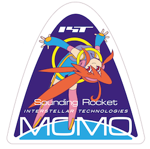

# OpenMOMO
Open data of sounding rocket "MOMO" by Interstellar Technologies Inc.

# Lisence
 This work is licensed under a <a rel="license" href="http://creativecommons.org/licenses/by-nc/4.0/">Creative Commons Attribution-NonCommercial 4.0 International License</a>.

"Interstellar Technologies Inc."
or "インターステラテクノロジズ株式会社" in Japanese.
